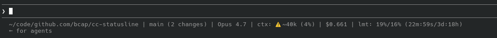

# claude code statusline

A custom statusline for [Claude Code](https://claude.com/claude-code). By default it shows your working directory, git branch, model, context usage, total session cost, and rate-limit status on a single line. [More fields available](#available-fields), configurable via flags.

Example:



(Above ran with `--ctx-warn 40 --ctx-crit 50` to demonstrate the warn indicator.)

## Requirements

- `python3` (3.8+) and `git` (standard on Linux/macOS)
- `bash`, `jq`, `curl` (only used by `install.sh`)

## Install

One-liner (installs latest from `main`):

```bash
curl -fsSL https://raw.githubusercontent.com/bcap/cc-statusline/main/install.sh | bash
```

Pin to a tagged release with `TAG=<tag>` (see [tags](https://github.com/bcap/cc-statusline/tags)):

```bash
curl -fsSL https://raw.githubusercontent.com/bcap/cc-statusline/main/install.sh | TAG=v0.2 bash
```

`TAG` accepts any git ref (tag, branch, or commit SHA); it defaults to `main`.

Or clone and install from a local copy:

```bash
git clone https://github.com/bcap/cc-statusline.git
cd cc-statusline
./install.sh --local
```

The installer:

- Writes `statusline.py` to `~/.claude/statusline.py` (override with `--path`)
- Adds a `statusLine` block to `~/.claude/settings.json`
- Refuses to overwrite an existing different `statusline.py`; shows a diff and prompts before changing an existing `statusLine` block
- Is safe to re-run: identical content is a no-op

Once installed, your statusline should update on the next refresh. If it doesn't, restart Claude Code.

## Uninstall

Remove `~/.claude/statusline.py` and delete the `statusLine` key from `~/.claude/settings.json`.

## Configuration

After installing, you can pass flags to `statusline.py` in your `~/.claude/settings.json`. Flags accept both `--key value` and `--key=value` forms.

```json
{
  "statusLine": {
    "type": "command",
    "command": "~/.claude/statusline.py --fields=cwd,git,model,ctx,session_cost --separator=' • '",
    "refreshInterval": 5
  }
}
```

### Flags

| Flag | Default | Description |
|---|---|---|
| `--fields LIST` | `cwd,git,model,ctx,session_cost,limits` | Comma-list of fields; order = display order |
| `--separator STR` | ` \| ` | Separator between fields |
| `--custom-field SPEC` | — | Define a custom field as `NAME=TEMPLATE`. Reference in `--fields` as `custom:NAME`. Repeatable. See [Custom fields](#custom-fields). |
| `--ctx-warn K` | `150` | Context warn threshold (k-tokens) |
| `--ctx-crit K` | `200` | Context critical threshold (k-tokens) |
| `--limits-5h-warn P` | `75` | 5-hour rate-limit warn % |
| `--limits-5h-crit P` | `100` | 5-hour rate-limit critical % |
| `--limits-week-warn P` | `75` | Weekly rate-limit warn % |
| `--limits-week-crit P` | `100` | Weekly rate-limit critical % |
| `--cache-warn P` | `80` | Cache hit ratio warn % (warn when below) |
| `--cache-crit P` | `50` | Cache hit ratio critical % (crit when below) |
| `--warn-str STR` | `⚠️` | Warn indicator prefix |
| `--crit-str STR` | `🔥` | Critical indicator prefix |
| `-h`, `--help` | — | Show help |

### Available fields

Any field below can be used directly in `--fields` or referenced inside a `--custom-field` template. Fields shown with a `str` type are pre-formatted (label prefix + warning indicator + value — what shows in the default statusline); the rest are typed values useful in custom templates or as standalone fields without decoration. Multiple fields cover the same underlying data at different formatting levels (e.g. `ctx` / `ctx_pct` / `ctx_tokens_k`).

Grouped by topic below for readability — there is no categorical distinction, all entries are just fields.

**Context window**

| Name | Type | Description |
|---|---|---|
| `ctx` | str | e.g. `ctx: ~80k (8%)`; warn/crit indicator over threshold |
| `ctx_pct` | float | context usage % |
| `ctx_tokens_k` | int | context usage in k-tokens |
| `ctx_warning` | str | warn/crit indicator for ctx (empty when under thresholds) |

**Rate limits**

| Name | Type | Description |
|---|---|---|
| `limits` | str | e.g. `lmt: 6%/10% (16m:40s/1h:23m)`; warn/crit indicator over threshold |
| `limit_5h_pct` | float | 5h rate-limit usage % |
| `limit_week_pct` | float | weekly rate-limit usage % |
| `limit_5h_reset_sec` | int | seconds until 5h limit resets |
| `limit_week_reset_sec` | int | seconds until weekly limit resets |
| `limit_5h_reset` | str | 5h reset countdown (human, e.g. `2h:44m`) |
| `limit_week_reset` | str | weekly reset countdown (human) |
| `limit_5h_warning` | str | warn/crit indicator for 5h limit |
| `limit_week_warning` | str | warn/crit indicator for weekly limit |

**Cost**

| Name | Type | Description |
|---|---|---|
| `session_cost` | str | total session cost in USD, e.g. `$6.761` |
| `turn_cost` | str | estimated USD cost of the last API call (per-model pricing with 5m cache-write multiplier). Empty before the first API call, after `/compact`, or for unknown models. |
| `session_cost_usd` | float | total session cost in USD (raw) |
| `turn_cost_usd` | float | last API call cost in USD (raw) |

**Cache**

| Name | Type | Description |
|---|---|---|
| `cache_hit` | str | prompt cache hit ratio for the last API call, `cache_read / (cache_read + cache_creation + input)`. Warn/crit when **below** `--cache-warn` / `--cache-crit` (inverted: low is bad). |
| `cache_hit_pct` | float | prompt cache hit ratio % |
| `cache_hit_warning` | str | warn/crit indicator for cache (inverted) |

**Lines changed**

| Name | Type | Description |
|---|---|---|
| `changes` | str | total lines added + removed, prefixed with `Δ` |
| `added` | str | total lines added, prefixed with `+` |
| `removed` | str | total lines removed, prefixed with `-` |
| `lines_added` | int | total lines added this session |
| `lines_removed` | int | total lines removed this session |
| `lines_changed` | int | `lines_added + lines_removed` |

**Git**

| Name | Type | Description |
|---|---|---|
| `git` | str | branch + change count, e.g. `main (3 changes)` |
| `git_branch` | str | current git branch (bare) |
| `git_changes` | int | count of uncommitted changes |

**Session / misc**

| Name | Type | Description |
|---|---|---|
| `cwd` | str | current working directory (`$HOME` shown as `~`) |
| `model` | str | model display name, e.g. `Opus 4.7` |
| `session` | str | session name (or `UNNAMED`) |
| `session_id` | str | full session UUID |
| `effort` | str | effort level (e.g. `high`) |
| `version` | str | Claude Code version, e.g. `v2.1.139` |
| `agent` | str | active subagent name, prefixed with `@` |
| `worktree` | str | worktree name, prefixed with `wt:` |
| `transcript_path` | str | path to the session transcript JSONL |
| `api_duration` | str | total API time this session (human duration) |
| `duration` | str | total wall-clock time this session (human duration) |

### Custom fields

Define a field with `--custom-field NAME=TEMPLATE` and reference it in `--fields` as `custom:NAME`. The template uses Python [format string syntax](https://docs.python.org/3/library/string.html#format-string-syntax) and can reference any built-in field by name:

```json
{
  "statusLine": {
    "type": "command",
    "command": "~/.claude/statusline.py --fields=cwd,git,model,custom:limits5h --custom-field='limits5h={limit_5h_warning}5h: {limit_5h_pct:.1f}% (resets in {limit_5h_reset})'"
  }
}
```

`--custom-field` is repeatable. The flag value must contain `=` separating name and template; the template itself can contain anything except an unmatched `{` or `}`.

**Namespaces.** Custom field names live in their own namespace and may share a name with a built-in — they only collide if used the same way. In `--fields`, a bare name (`model`) always means the built-in; `custom:model` is the custom. Inside a template, `{model}` always means the built-in. So `--custom-field='model=model: {model}'` is fine — the template references the built-in `model`, no self-reference.

**Skip rules.** If *any* referenced field is currently unavailable (e.g. limits before the first API call), the whole custom field is skipped — including its separator — so you never see partial garbage like `5h:  % (resets in )`.

**No custom-to-custom references.** A template can only reference built-in fields. If you need composition across customs, express it inline (the template literal already lets you combine multiple fields), or wrap the statusline command in a shell pipeline.

**Safety.** Templates are restricted to literal text + `{name}` or `{name:format_spec}` or `{name!conversion}` (where conversion is `s`/`r`/`a`). Attribute access (`{x.__class__}`), indexing (`{x[0]}`), and nested replacement fields (`{x:{y}}`) are rejected — this is enforced because the template is read from your settings and is not a place where you'd want arbitrary attribute traversal.

**Strict validation.** Argument errors hard-fail at startup (exit 2, message to stderr): unknown names in `--fields`, references to undefined `custom:NAME`, template syntax errors, and unknown field names referenced inside a template.

## Troubleshooting

If the statusline doesn't appear or looks wrong:

1. Run it against the example payload:
   ```bash
   ./statusline.py < statusline_input_example.json
   ```
2. Run the test suite: `python3 -m unittest test_statusline`
3. Confirm `python3` is installed and on `PATH`.

## License

MIT
